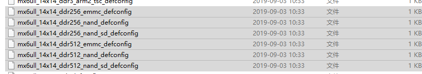

# 第4讲 U-Boot 源码目录分析

> 来源：正点原子官方笔记整理

## 一、U-Boot 源码目录分析

1. 因为 U-Boot 会使用一些编译后才生成的文件，所以分析 U-Boot 前需要先编译一次。
2. `arch/arm/cpu/u-boot.lds` 是整个 U-Boot 的链接脚本。
3. `board/freescale/mx6ullevk` 是重点板级目录。
4. `configs` 目录是 U-Boot 默认配置文件目录，里面的配置文件通常以 `_defconfig` 结尾，对应不同板子。

示例配置文件：



```text
mx6ull_alientek_alpha_ddr256_emmc_defconfig
```

移植 U-Boot 时重点关注：

- `board/freescale`
- `configs` 目录中对应板子的 `_defconfig`

执行 `make xxx_defconfig` 后会生成 `.config` 文件，此文件保存详细的 U-Boot 配置信息。顶层 `README` 也非常重要，建议阅读，它介绍了 U-Boot 的整体使用和配置。编译产物 `u-boot` 是带 ELF 信息的 U-Boot 可执行文件。
