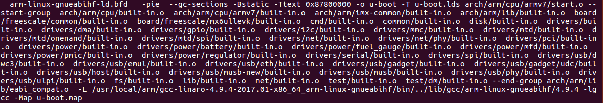

# 第5讲 U-Boot 顶层 Makefile 分析

> 来源：正点原子官方笔记整理

## 一、U-Boot 源码 VSCode 工程创建

本节主要记录顶层 `Makefile` 的分析过程。

## 二、顶层 Makefile 分析

### 2.1 工具链变量

```make
AS = $(CROSS_COMPILE)as
```

展开后示例：

```make
AS = arm-linux-gnueabihf-as
```

### 2.2 常见变量值

```make
ARCH = arm
CPU = armv7
BOARD = mx6ullevk
VENDOR = freescale
SOC = mx6
CPUDIR = arch/arm/cpu/armv7
BOARDDIR = freescale/mx6ullevk
```

## 三、编译处理过程

### 3.1 清理工程

```bash
make distclean
```

### 3.2 默认配置

```bash
make mx6ull_14x14_ddr512_emmc_defconfig
```

`make xxx_defconfig` 对应的规则：

```make
%config: scripts_basic outputmakefile FORCE
	$(Q)$(MAKE) $(build)=scripts/kconfig $@
```

执行过程主要分为两个目标：

1. `scripts_basic`
2. `outputmakefile`

### 3.3 `scripts_basic` 目标

```make
scripts_basic:
	$(Q)$(MAKE) $(build)=scripts/basic
```

展开后：

```bash
make -f ./scripts/Makefile.build obj=scripts/basic
```

其中 `build` 定义在 `scripts/Kbuild.include`：

```make
build := -f $(srctree)/scripts/Makefile.build obj
build := -f ./scripts/Makefile.build obj
```

第一条命令执行时：

```make
src = scripts/basic
kbuild-dir = ./scripts/basic
kbuild-file = ./scripts/basic/Makefile
```

随后会包含：

```make
include ./scripts/basic/Makefile
```

默认构建目标可简化为：

```make
__build: $(builtin-target) $(lib-target) $(extra-y) $(subdir-ym) $(always)
	@:
```

对 `scripts/basic` 来说，核心目标是生成：

```text
scripts/basic/fixdep
```

对应源码文件：

```text
scripts/basic/fixdep.c
```

### 3.4 `scripts/kconfig` 目标

第二条命令：

```bash
make -f ./scripts/Makefile.build obj=scripts/kconfig xxx_defconfig
```

相关变量：

```make
src = scripts/kconfig
kbuild-dir = ./scripts/kconfig
kbuild-file = ./scripts/kconfig/Makefile
```

随后会包含：

```make
include ./scripts/kconfig/Makefile
```

核心规则：

```make
%_defconfig: $(obj)/conf
	$(Q)$< $(silent) --defconfig=arch/$(SRCARCH)/configs/$@ $(Kconfig)
```

展开理解：

```bash
scripts/kconfig/conf --defconfig=arch/../configs/xxx_defconfig Kconfig
```

### 3.5 编译

```bash
make V=1 -j12
```

默认目标：

```make
PHONY := _all
_all: all

all: $(ALL-y)
ALL-y += u-boot.srec u-boot.bin u-boot.sym System.map u-boot.cfg binary_size_check
```

`u-boot.bin` 的生成依赖：

```make
u-boot.bin: u-boot-nodtb.bin FORCE
	$(call if_changed,copy)

u-boot-nodtb.bin: u-boot FORCE
	$(call if_changed,objcopy)
	$(call DO_STATIC_RELA,$<,$@,$(CONFIG_SYS_TEXT_BASE))
	$(BOARD_SIZE_CHECK)
```

`u-boot` 的链接规则：

```make
u-boot: $(u-boot-init) $(u-boot-main) u-boot.lds FORCE
	$(call if_changed,u-boot__)
```

其中：

```make
u-boot-init := $(head-y)
u-boot-main := $(libs-y)

head-y = arch/arm/cpu/armv7/start.o
```

`libs-y` 保存源码目录，并最终对应大量 `built-in.o`：

```make
libs-y += lib/   # lib/built-in.o
```

所以，`u-boot` 本质上是将 `start.o` 和大量 `built-in.o` 链接在一起。

条件编译示例：

```make
CONFIG_ONENAND_U_BOOT = y
ALL-$(CONFIG_ONENAND_U_BOOT)
ALL-y += u-boot-onenand.bin
```

## 四、链接

U-Boot 的链接脚本为 `u-boot.lds`，U-Boot 链接首地址为 `0x87800000`。



`mx6_common.h` 中设置了：

```c
#define CONFIG_SYS_TEXT_BASE 0x87800000
```
