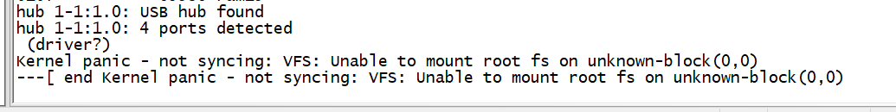

# 第13讲 Linux内核移植

> 来源：正点原子官方笔记整理

## 一、创建 VSCode 工程

1. 将 NXP 官方 Linux 内核拷贝到 Ubuntu。
2. 解压源码包：

   ```bash
   tar -vxjf linux-imx-rel_imx_4.1.15_2.1.0_ga.tar.bz2
   ```

## 二、NXP 官方开发板 Linux 内核编译

编译 NXP 官方 EVK 开发板对应的 Linux 系统。

默认配置文件存放路径：

```text
arch/arm/configs
```

最终编译产物：

- `zImage`
- `imx6ull-14x14-evk-emmc.dtb`
- `imx6ull-14x14-evk.dtb`

将 `zImage` 和 `imx6ull-14x14-evk-emmc.dtb` 拷贝到 `tftpboot` 目录下，然后在 U-Boot 中通过 TFTP 服务启动。

经过测试，NXP 官方开发板对应的 `zImage` 和 `.dtb` 可以在正点原子开发板上启动。



Linux 启动遇到上图错误，是因为没有根文件系统。

## 三、使能 8 线 EMMC

修改设备树 `imx6ull-alientek-emmc.dts` 中的 `usdhc2` 节点。

## 四、网络驱动修改

为什么一开始就修改网络驱动：Linux 驱动开发时通常通过网络调试。

修改网络复位 IO 和 PHY ID 后，Linux 内核内部通用 PHY 驱动已经可以正常工作。

`LAN8720` 的生产厂家是 SMSC。需要使能 SMSC 驱动，然后重新编译 Linux 内核，并通过 TFTP 启动验证。

## 五、在 Linux 中添加自己的开发板

需要新增或修改：

1. `imx6_alientek_emmc_defconfig` 默认配置文件。
2. `imx6ull-alientek-emmc.dts`，编译后生成对应 `.dtb` 文件。
3. `arch/arm/boot/dts/Makefile`，让新设备树参与编译。

操作记录：

```text
复制 arch/arm/configs/imx_v7_mfg_defconfig
为   arch/arm/configs/imx_alientek_emmc_defconfig
```

```text
复制 arch/arm/boot/dts/imx6ull-14x14-evk.dts
为   arch/arm/boot/dts/imx6ull-alientek-emmc.dts
```

然后修改：

```text
arch/arm/boot/dts/Makefile
```

## 六、CPU 主频和网络驱动修改

### 6.1 修改前提

修改驱动前，要先保证板子能够正常启动。

根文件系统也要处理好，可以先使用现成根文件系统。确保 EMMC 已经烧写系统，并设置好 `bootcmd` 和 `bootargs`。

### 6.2 `bootcmd`

`bootcmd` 设置为默认从网络启动，通过 TFTP 加载：

```bash
setenv bootcmd 'tftp 80800000 zImage;tftp 83000000 imx6ull-alientek-emmc.dtb;bootz 80800000 - 83000000;'
```

### 6.3 `bootargs`

根文件系统存放在 EMMC 分区 2 中，`bootargs` 设置为：

```bash
setenv bootargs 'console=ttymxc0,115200 root=/dev/mmcblk1p2 rootwait rw'
```

### 6.4 修改 EMMC 驱动

当前问题是 EMMC 驱动有问题，需要在 `imx6ull-alientek-emmc.dts` 中找到 `usdhc2` 节点并修改为：

```dts
&usdhc2 {
	pinctrl-names = "default", "state_100mhz", "state_200mhz";
	pinctrl-0 = <&pinctrl_usdhc2_8bit>;
	pinctrl-1 = <&pinctrl_usdhc2_8bit_100mhz>;
	pinctrl-2 = <&pinctrl_usdhc2_8bit_200mhz>;
	bus-width = <8>;
	non-removable;
	status = "okay";
};
```

修改完成后编译设备树：

```bash
make dtbs
```

### 6.5 配置主频

超频到 696 MHz，NXP 官方宣传为 700 MHz。打开 `imx6ull.dtsi` 文件继续修改对应配置。

> 原笔记此处未继续记录具体修改项，后续学习时再补充。
