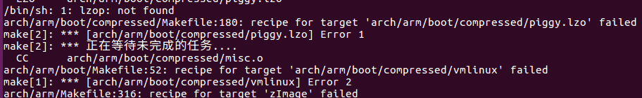
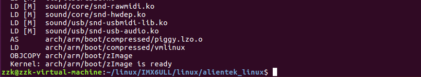

# 第9讲 正点原子官方Linux内核编译与体验

> 来源：正点原子官方笔记整理

## 一、正点原子官方 Linux 内核编译

### 1.1 类比 U-Boot 编译步骤

U-Boot 常见编译步骤：

1. `distclean` 清理工程。
2. `make xxx_defconfig` 使用默认配置文件配置工程。
3. `make -j12` 编译。
4. `make menuconfig` 打开配置界面并进行配置。

Linux 内核的默认配置文件保存在：

```text
arch/arm/configs
```

### 1.2 依赖问题

如果编译时遇到下图错误：



安装 `lzop`：

```bash
sudo apt-get install lzop
```

### 1.3 编译产物

编译完成如下图所示：



常见产物路径：

| 文件 | 路径 |
| ---- | ---- |
| `zImage` | `./arch/arm/boot/zImage` |
| `.dtb` | `./arch/arm/boot/dts/xxx.dtb` |

也可以根据需要编译单个指定的 `.dts` 文件。

## 二、正点原子官方 Linux 内核测试

后续使用编译出的 `zImage` 和 `.dtb` 启动开发板进行验证。
